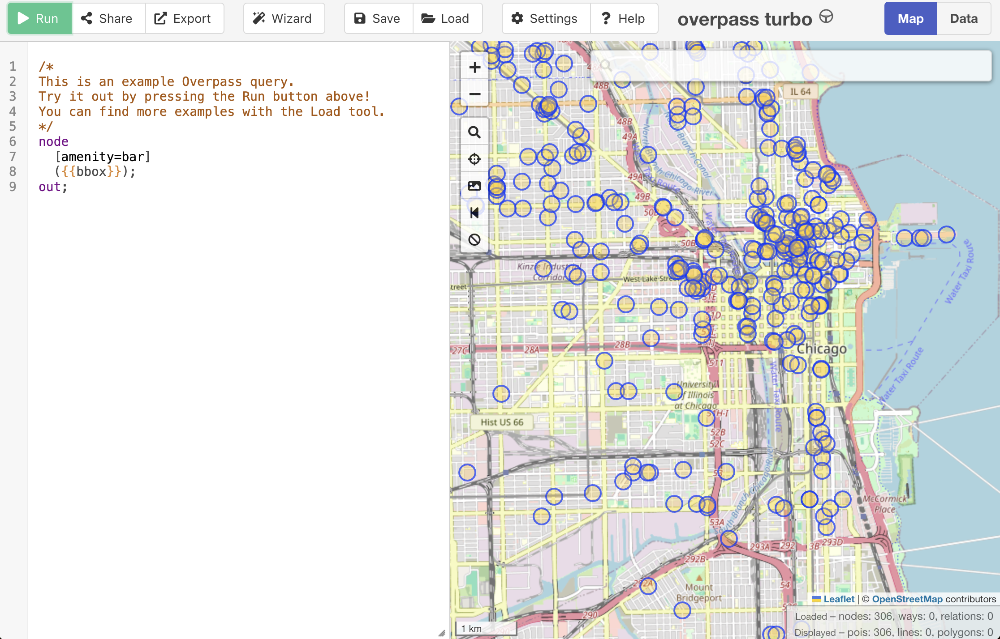
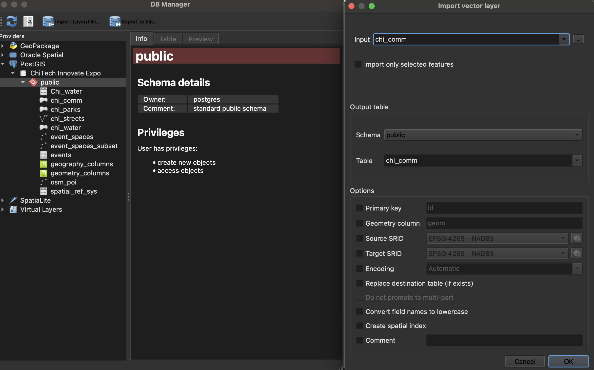
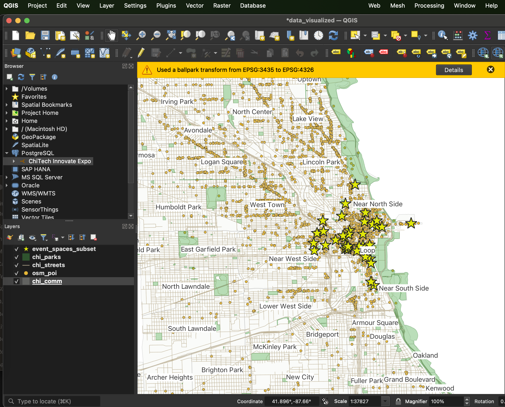
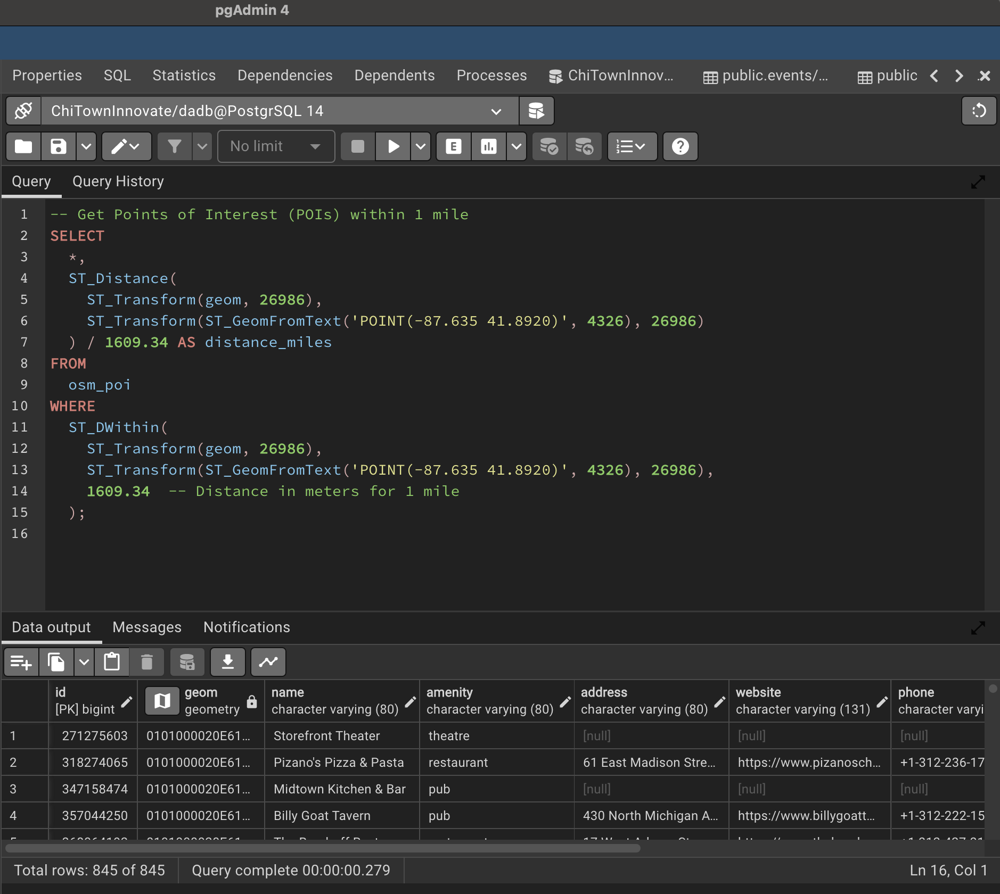
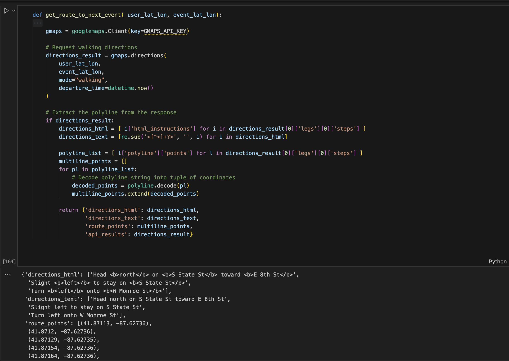

#### Final Project Walkthrough - Spatial Data Science Heinz CMU 2024
## _What’s nearby?_ - A Proximity Point of Interest Routing Website for the _‘ChiTech Innovate Expo’_
##### By: Colton Lapp // Spring 2024

### Overview:
This project created a point of interest mapping and routing website for a mock tech expo - _The ChiTech Innovate Expo_ - in Chicago, IL. The goal of the project was to asses the capability of open source GIS tools when it comes to efficiently querying, analyzing and mapping geospatial data. The application takes in a individual's location coordinates and the time of day, and then returns walking directions to the next scheduled event as well as a map of nearby restaurants, cafes and bars. 

### Demo:

<figure>
    
    <figcaption><em>Demo of Dynamic Website Creation</em></figcaption>
</figure>

### Tools Used:
- **PostgreSQL / PostGIS** - storage of geospatial datasets
- **Folium** (Python package) - creation of .html web maps
- **Geopands / Shapely** (Python packages) - Geospatial analysis of geometries 
- **Google Maps API** - Used to retrieve routing directions
- **Open Street Map** - Scraped and saved points of interest, including bars, restaurants, cafes, and more
- **Flask** (Python package) - Used to build a website to generate and display the web maps
- **QGIS** - Used to do exploratory data analysis of event spaces
- **ChatGPT / DALL E** - Used to create logos, create fake event data, and for code assistance

---

### Procedure:
- **Created and Retrieved Data**
    - Scraped lat/lon and venue names for conference centers in Downtown Chicago from Google Maps
    - Created fake tech event data in .csv format in ChatGPT
    - Scraped and cleaned all point of interest data in Downtown Chicago from open street maps using a Python script
    - Wrote Python function to create random location and time
    - Downloaded Chicago shapefiles (streets, water, parks, neighborhoods) from public websites
    - Generated logos using image generators

<figure>
    
    <figcaption><em>Visualization of Open Street Map's Bars in Chicago</em></figcaption>
</figure>

- **Created PostgreSQL database and saved datasets**
     - Used QGIS to load geospatial datasets into custom PostgreSQL database

<figure>
    
    <figcaption><em>Loading Datasets into PostgreSQL using QGIS</em></figcaption>
</figure>

- **Visualized event, POI, shapefile data in QGIS**

<figure>
    
    <figcaption><em>Mapping the Open Street Maps Point of Interest Data, Chicago Shapefiles, and Scraped Conference Center Locations.</em></figcaption>
</figure>

- **Wrote Spatial SQL code to query nearby POI, upcoming expo events and close by shapefiles**
    - In Python, used Psycog2 package to connect to local PostgreSQL database. After generating random user location/time, queried the following:
        - Close by Points of Interest (POI)
        - Upcoming events, joined to the event venue data
        - Close by shapefiles 
        
<figure>
    
    <figcaption><em>Demonstrating Spatial SQL capabilities in PGAdmin.</em></figcaption>
</figure>

- **Set up Google Maps API and wrote code to compute walking directions between user location and next expo event**
    - Decoded google maps polystrings into multiline points for easier mapping

<figure>
    
    <figcaption><em>Example of Google Maps API code.</em></figcaption>
</figure>

    
- **Used Folium to create interactive HTML maps**
    - Customized markers using html syntax and custom logos
    - Customized popup displays using calculated information like distance, etc

- **Used Flask to create a webapp for dynamic creation of maps**
    - Wrapped all querying, analysis, and mapping code in a python script
    - Built a basic webpage using Janja2 and Flask to allow user to trigger the generation of a random location/time and the recompiling of the map

     

