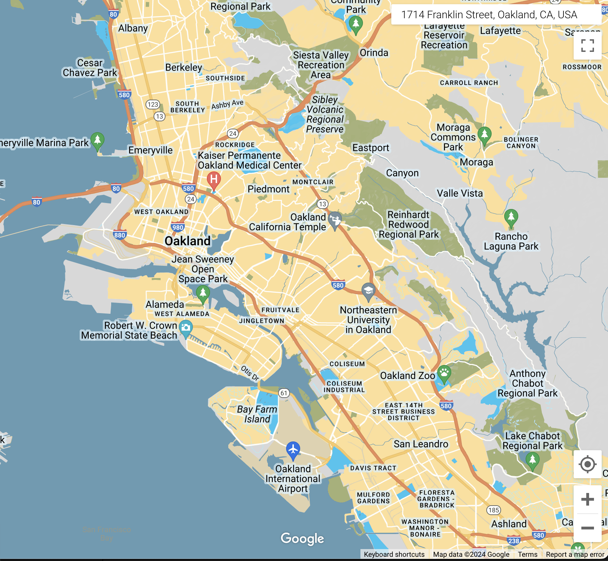

## Custom Stylized Google Maps Basemap

---

[Go to interactive map](./givewell_google_styling.html)

[Bid pdf](./bid.pdf)

## Overview:
I sourced and downloaded the GiveWell logos for color reference - extracting key branding colors to generate a custom color palette. Following this, I designed a bespoke Google basemap, adjusting color schemes to match those extracted from the logo. I documented the JSON styler information in a downloadable file so that the non-profit may use the style for future web development.

## Design Steps Taken:
- Generated palette of colors to match non-profits logo
- Adjusted colors of stylized Google basemap. Featured orange prominently to draw strong recognition to the brand, with blue accents. Hid business labels as they are not relevant to the non-profit
- Created .html map using stylized JSON script 
- Created point class of non-profits in Oakland and overlayed on top of custom basemap 

### Reference Logos:

### Color Palette Used 
- #FCB81B (orange)
- #29C5F1 (light blue)
- #669BB3 (teal)
- #3A3A3A (grey)
- #FBFAFF (white)

## Customized Basemap

### Styling 
|-----------------+-----------------------+-------------------|
| Feature Type              | Element Type         | Hex Code |
|-----------------+-----------------------+-------------------|
| -                         | geometry             | #ebe3cd  |
| -                         | geometry.fill        | #fcb81b  |
| -                         | labels.text.fill    | #000000  |
| -                         | labels.text.stroke  | #669bb3  |
| administrative            | geometry.stroke     | #c9b2a6  |
| administrative.land_parcel| geometry.stroke     | #dcd2be  |
| administrative.land_parcel| labels.text.fill    | #ae9e90  |
| landscape                 | geometry.fill       | #dfd2ae  |
| landscape.natural         | geometry             | #dfd2ae  |
| landscape.natural         | geometry.fill       | #3a3a3a  |
| poi                       | geometry             | #dfd2ae  |
| poi                       | geometry.fill        | #29c5f1  |
| poi.business              | labels               | #ffffff  |
| poi.park                  | geometry.fill       | #a5b076  |
| poi.sports_complex        | labels               | #ffffff  |
| road                      | geometry             | #f5f1e6  |
| road                      | geometry.fill        | #29c5f1  |
| road.arterial             | geometry             | #fdfcf8  |
| road.highway              | geometry             | #f8c967  |
| road.highway              | geometry.stroke      | #e9bc62  |
| road.highway.controlled_access | geometry      | #e98d58  |
| road.highway.controlled_access | geometry.stroke | #db8555  |
| road.local                | labels.text.fill    | #806b63  |
| transit.line              | geometry             | #dfd2ae  |
| transit.line              | labels.text.fill    | #8f7d77  |
| transit.line              | labels.text.stroke  | #ebe3cd  |
| transit.station           | geometry             | #dfd2ae  |
| water                     | geometry.fill       | #669bb3  |
| water                     | labels.text.fill    | #92998d  |
|-----------------+----------------------+----------------|

[Download JSON Styler](./homeworks/givewell_styling.json)